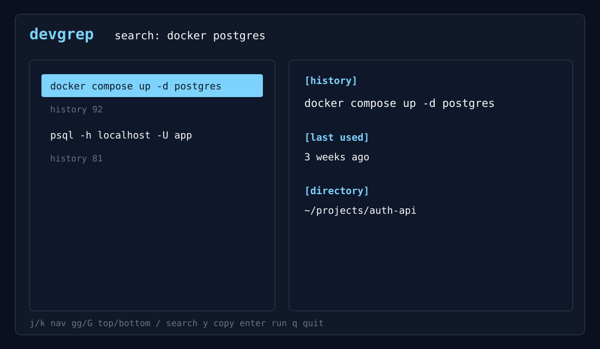
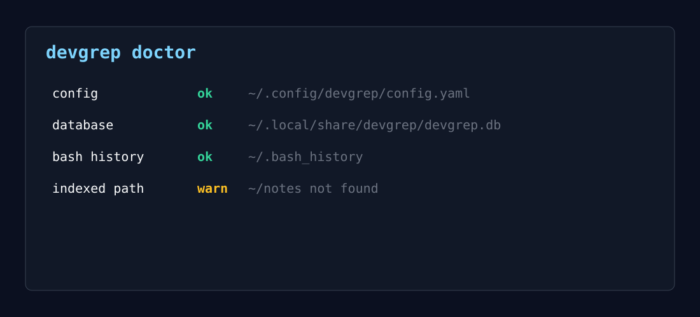

<div align="center">


<strong>Search your developer workflow history instantly.</strong>

<p>
Terminal-native search for shell history, logs, markdown notes,
and indexed project workflows.
</p>

<p>
<a href="https://github.com/aasixh/devgrep">GitHub</a>
&nbsp;·&nbsp;
<a href="https://devgrep.vercel.app/">Documentation</a>
&nbsp;·&nbsp;
<a href="https://github.com/aasixh/devgrep/releases">Releases</a>
&nbsp;·&nbsp;
<a href="https://x.com/aasixh">Twitter/X</a>
</p>

<p>


</p>

</div>
**devgrep** is a terminal-native search engine for developer workflows. It indexes shell history, log files, and markdown notes into a local SQLite database so you can recover commands, debugging steps, and project context without digging through scattered files.

No cloud. No accounts. No telemetry. No AI layer — just fast, offline search in your terminal.

<p align="center">
  
</p>

---

## Why devgrep

You fix a hard problem once. The command lives in history for a week, then vanishes behind newer entries, log rotations, and half-written notes.

devgrep keeps those breadcrumbs searchable:

- shell commands you already ran
- deployment and Docker workflows
- log lines with severity
- markdown notes and runbooks

Everything stays on your machine in `~/.local/share/devgrep/devgrep.db`.

---

## Install

**Go**

```sh
go install github.com/aasixh/devgrep@latest
```

**Release binary**

```sh
curl -fsSL https://raw.githubusercontent.com/aasixh/devgrep/main/scripts/install.sh | sh
```

**Build from source**

```sh
git clone https://github.com/aasixh/devgrep
cd devgrep
make build
./bin/devgrep version
```

Platforms: Linux, macOS, and Windows (`amd64` / `arm64`) via manual method (docs/release.md).

---

## Quick start

```sh
# Build your first index (shell history + default paths)
devgrep index

# Search — opens the TUI when stdout is a terminal
devgrep search "docker postgres"

# Shorthand (same as search)
devgrep docker postgres
```

**Plain output** for scripts and pipes:

```sh
devgrep --plain search "kube auth failed" --source history,logs
```

```text
[history]
docker compose up -d postgres

[last used]
3 weeks ago

[directory]
~/projects/auth-api

[score]
92
```

**Index a project** before searching its logs and notes:

```sh
devgrep index .
devgrep search "migration failed"
```

---

## Example workflows

### Recover a shell command

```sh
devgrep search "kubectl rollout undo"
```

Results show the original command, when you last ran it, and the working directory inferred from history.

### Find a deployment step

```sh
devgrep --plain search "terraform apply staging"
```

### Search project logs

```sh
devgrep index ~/projects/api
devgrep search --source logs "connection refused"
devgrep search --source logs --tail --regex "ERROR|WARN"
```

### Search markdown notes

```sh
devgrep search --source notes "postgres failover"
```

### Inspect what is indexed

```sh
devgrep sources
devgrep sources --tree
devgrep stats
devgrep doctor
```

---

## Features

| | |
| --- | --- |
| **Local-first** | SQLite storage, WAL mode, incremental indexing |
| **Shell history** | Bash and zsh, duplicate suppression, cwd inference |
| **Logs** | `.log` files with severity detection and tail mode |
| **Notes** | Markdown fragments from configured paths |
| **Search** | Fuzzy matching with typo-tolerant ranking fallback |
| **TUI** | Full-screen Bubble Tea UI, vim-style navigation |
| **Watch mode** | `fsnotify` re-indexing for explicit project paths |
| **Unix-friendly** | `--plain` output, direct search shorthand, pipe-safe |
| **Operational** | `sources`, `stats`, and `doctor` for visibility |

---

## How indexing works

```text
  ~/.bash_history ──┐
  ~/.zsh_history  ──┼──► indexers ──► SQLite ──► search + ranking ──► TUI / plain output
  *.log, *.md     ──┘         ▲
                              │
                    incremental offsets + watch
```

1. **Indexers** parse history, logs, and notes into normalized documents.
2. **Storage** persists documents, source offsets, and search stats.
3. **Search** loads candidates from SQLite, applies fuzzy matching, and ranks results.
4. **Commands** expose indexing, search, and maintenance through Cobra.

Shell history is indexed incrementally. Log and note indexers walk configured paths with shared ignore rules (`.git`, `node_modules`, large files, binaries, and more).

---

## Sources

| Source | Location | Label in results |
| --- | --- | --- |
| Shell history | `~/.bash_history`, `~/.zsh_history` | `[history]` |
| Logs | `.log` under `indexed_paths` | `[log]` |
| Notes | `.md` under `indexed_paths` | `[note]` |

Default note/log discovery paths (overridable in config):

```text
.
~/notes
~/Documents
```

Config: `~/.config/devgrep/config.yaml` · Database: `~/.local/share/devgrep/devgrep.db`

See [examples/config.yaml](examples/config.yaml) and [docs/config.md](docs/config.md).

---

## Commands

| Command | Description |
| --- | --- |
| `devgrep search [query]` | Search indexed workflows (TUI or plain) |
| `devgrep [query]` | Shorthand for `search` |
| `devgrep index [path...]` | Index history, logs, and notes |
| `devgrep index . --dry-run` | Preview files without writing to SQLite |
| `devgrep index <path> --no-watch` | Index once, do not stay in watch mode |
| `devgrep index --watch` | Restore and run persisted watchers |
| `devgrep sources` | List indexed source locations |
| `devgrep sources --tree` | Tree view of indexed paths |
| `devgrep stats` | Document counts, DB size, top searches |
| `devgrep doctor` | Local health checks |
| `devgrep version` | Version and build metadata |

**Global flags:** `--config`, `--db`, `--plain`, `--verbose`

**Search flags:** `--source history,logs,notes`, `-n` limit, `-i` force TUI, `--tail`, `--regex`, `--severity`

**Index flags:** `--source`, `--path`, `--watch`, `--no-watch`, `--dry-run`, `-y` confirm risky paths

---

## Interactive TUI

When stdout is a TTY, search opens a full-screen interface:

<p align="center">
  
</p>

| Key | Action |
| --- | --- |
| `/` | Focus live search |
| `j` / `k` | Move selection |
| `gg` / `G` | Jump to top / bottom |
| `enter` | Run selected history command |
| `y` | Copy selected result |
| `esc` / `q` | Quit |

Log and note previews include nearby context lines when the source file is still on disk.

---

## Watch mode

Indexing an explicit directory persists it as a watched path and, by default, keeps it synchronized:

```sh
devgrep index ~/projects/api
```

Watch mode uses `fsnotify` with debounced updates. New and modified files are re-indexed; deleted files are removed from the database.

```sh
devgrep index ~/projects/api --no-watch   # index once
devgrep index --watch                     # restore saved watchers
```

Risky paths (`/`, `~`) require confirmation unless you pass `--yes`. Use `--dry-run` to inspect a tree before indexing.

---

## Architecture

```text
cmd/                  Cobra commands and CLI wiring
internal/history/     bash/zsh parsing and incremental history indexing
internal/logs/        log indexing and tail mode
internal/indexer/     pluggable indexer interface, markdown notes
internal/storage/     SQLite migrations, documents, source state
internal/search/      fuzzy search, formatting, result types
internal/ranking/     scoring model (recency, frequency, fuzzy, cwd, …)
internal/tui/         Bubble Tea interface
internal/doctor/      health checks
```

New sources implement the `Indexer` interface in `internal/indexer` without changing command wiring.

Deeper detail: [docs/architecture.md](docs/architecture.md)

---

## Configuration

devgrep runs with sensible defaults. No config file is required for the first run.

On first `devgrep index`, defaults are written to `~/.config/devgrep/config.yaml` if missing. Customize indexed paths, ignore rules, ranking weights, history limits, log extensions, and TUI colors.

Full reference: [docs/user-manual.md](docs/user-manual.md) · [docs/config.md](docs/config.md)

---

## Development

```sh
make build    # bin/devgrep
make test     # race detector + coverage
make lint     # golangci-lint or go vet
make bench    # includes 100k-document search benchmark
```

Contributions welcome. Good starting points: new local source indexers, ranking improvements, shell-specific history metadata, and benchmarks.

Please keep changes **offline-first**, **terminal-first**, and **dependency-conscious**.

---

## Privacy

devgrep does not phone home. It does not collect usage data, queries, commands, paths, or logs. Indexing and search happen entirely on local files you point it at.

---

## License

[MIT](LICENSE)
